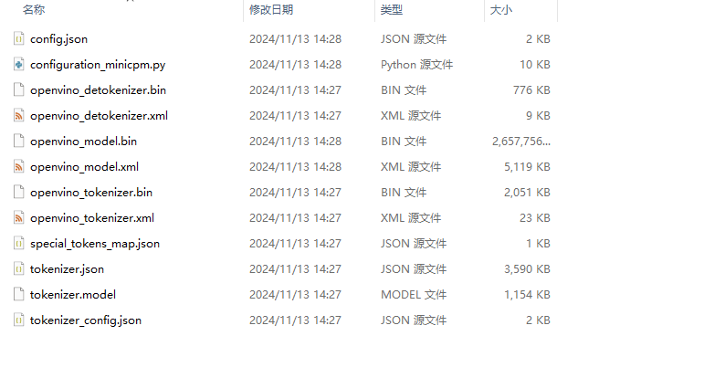
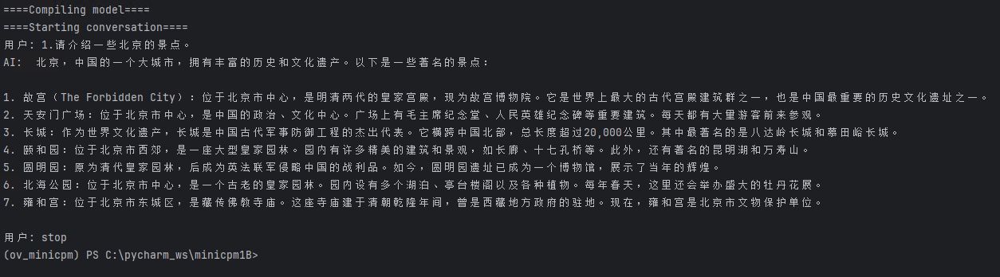

# OpenVINO™ backend on MiniCPM-1B-sft-bf16
* Model: https://huggingface.co/openbmb/MiniCPM-1B-sft-bf16
* Step 1. create python environment

``` sh
conda create -n ov_minicpm python=3.10
conda activate ov_minicpm
pip install -r requirements.txt
```

* Step2. Convert MiniCPM-1B-sft-bf16 model to OpenVINO™ IR(Intermediate Representation). Be patient, it may takes some time.
``` sh
python convert_miniCPM1B.py -m /path/to/MiniCPM-1B-sft-bf16 -o /path/to/MiniCPM-1B-sft-bf16_ov
```
</img>
* Step3. Testing
``` sh
python chat_miniCPM1B.py -m /path/to/MiniCPM-1B-sft-bf16_ov -d "GPU"
```
</img>