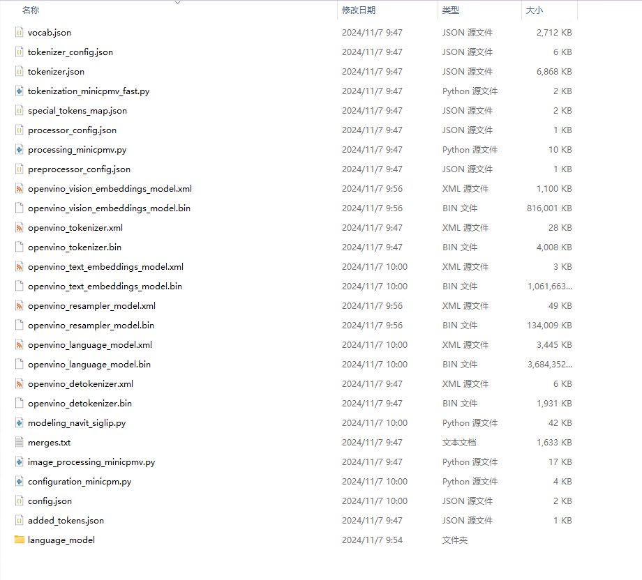
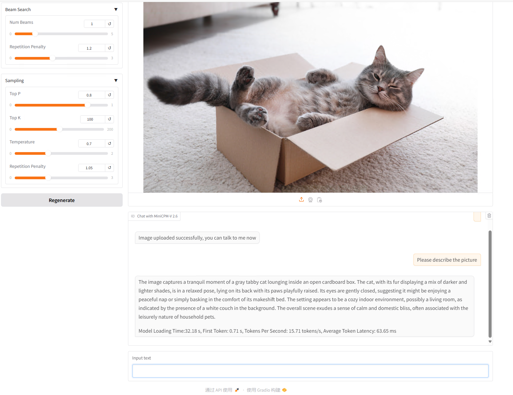
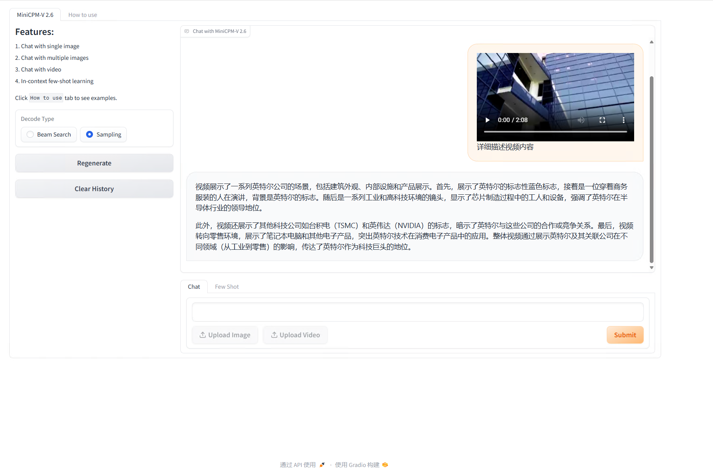

# OpenVINO™ backend on MiniCPM-V26
* Model: https://huggingface.co/openbmb/MiniCPM-V-2_6
* Step 1. create python environment

``` sh
conda create -n ov_minicpm python=3.10
conda activate ov_minicpm
pip install -r requirements.txt
```

* Step2. Convert minicpmV26 model to OpenVINO™ IR(Intermediate Representation). Be patient, it may takes some time.
``` sh
python convert_minicpmV26.py -m /path/to/minicpmV26 -o /path/to/minicpmV26_ov
```
</img>
* Step3. Testing
``` sh
python chat_minicpmV26.py -m /path/to/minicpmV26_ov -d "GPU"
```
</img>

* Step4. Testing width video
``` sh
python chat_minicpmV26_video.py -m /path/to/minicpmV26_ov -d "GPU"
```
</img>