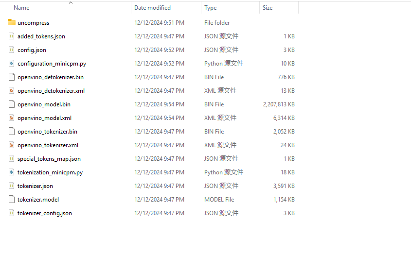
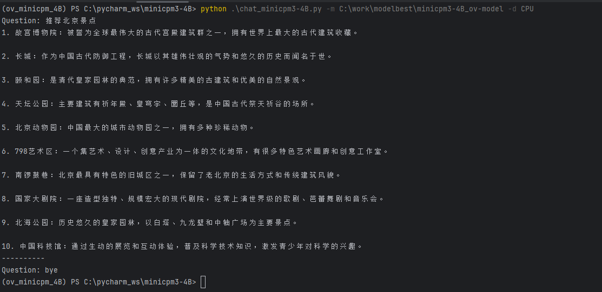

# OpenVINO™ backend on MiniCPM3-4B
* Model: https://huggingface.co/openbmb/MiniCPM3-4B

* Note: Using OpenVINO runtime nightly version. 
* iGPU is not supported yet. 
* OS: Windows 11
* CPU: Intel(R) Core(TM) Ultra 7 258V

# Step 1. create python environment

``` sh
conda create -n ov_minicpm_4B python=3.10
conda activate ov_minicpm_4B
pip install -r requirements.txt
```
OR
```
pip install --pre -U openvino openvino-tokenizers openvino-genai --extra-index-url https://storage.openvinotoolkit.org/simple/wheels/nightly
pip install nncf
pip install transformers==4.44.2
pip install torch
pip install torchvision
```

# Step2. Convert MiniCPM3-4B model to OpenVINO™ IR(Intermediate Representation). Be patient, it may takes some time.
``` sh
python convert_minincmp3-4B.py -m /path/to/minicpm3-4b -o /path/to/minicpm3-4b_ov
```
</img>
# Step3. Testing
``` sh
python chat_minicpm3-4B.py -m /path/to/inicpm3-4b_ov -d "CPU" # The demo can only use CPU. iGPU is not supported yet.
```
</img>
